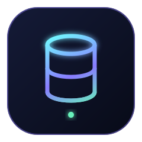

<div align="center">



### Query, inspect, and navigate your databases without leaving the keyboard.

[](https://go.dev)
[](#supported-databases)
[](#supported-databases)
[](#supported-databases)

[Get started](#quick-start) · [Install](#installation) · [Features](#built-for-database-work) · [Configuration](#configuration) · [Contributing](#contributing)

</div>

---

## Your Database Client, Minus the Context Switching

DB-Term is a keyboard-first database client built with [Bubble Tea](https://github.com/charmbracelet/bubbletea). It brings the connection tree, SQL editor, and result grid from desktop tools into a fast terminal workflow.

Connect to PostgreSQL, MySQL, or SQL Server. Browse schemas, preview tables, run and cancel queries, inspect foreign keys, and copy data without breaking focus.

| Connect with confidence | Explore without friction | Keep control of data |
|---|---|---|
| Store connection passwords locally with AES-256-GCM encryption. | Load databases, schemas, tables, views, columns, and foreign keys as you need them. | Review results in a keyboard-navigable grid, copy cells, filter, sort, and cancel long-running queries. |

```
╔══════════════════════════════════════════════════════════════════════╗
║  󰆼 DB-Term                                         [?] Help [q] Quit ║
╠════════════════╦═════════════════════════════════════════════════════╣
║  Connections   ║ 󰦕 Editor ─── local-pg › public ─── [Ctrl+↵] Run   ║
║                ║                                                     ║
║ 󰆼  local-pg  ● ║  SELECT id, name, email                             ║
║  ▼  public     ║  FROM users                                         ║
║     󰓫 Tables   ║  WHERE active = true                                ║
║     │  users   ║  ORDER BY name;                                     ║
║     │  orders  ║                                                     ║
║     󰒔 Views    ╠═════════════════════════════════════════════════════╣
║  󰆼  mysql-dev ○║  󰓪 Results  42 rows  󱑍 0.08s                        ║
║                ║                                                     ║
║                ║  id  │ name    │ email            │ active          ║
║  New [n]       ║ ─────┼─────────┼──────────────────┼───────          ║
║  Delete [d]    ║    1 │ Alice   │ alice@example.com│ true            ║
╠════════════════╩═════════════════════════════════════════════════════╣
║  󰆼 local-pg  ›  public    42 rows  󱑍 0.08s   [s] Settings  [?] Help ║
╚══════════════════════════════════════════════════════════════════════╝
```

---

## Built for Database Work

| | Capability | What it gives you |
|---|---|---|
| `01` | **Three-panel workspace** | Keep connection tree, SQL editor, and results visible in one focused layout. |
| `02` | **Multi-engine access** | PostgreSQL, MySQL, and SQL Server drivers are compiled into one binary. |
| `03` | **Results that move** | Page through 500 rows at a time, navigate by cell, copy values, sort, filter, and follow foreign keys. |
| `04` | **Safe connection handling** | Passwords are encrypted locally; keepalive pings preserve idle sessions; active queries can be cancelled. |
| `05` | **Yours to tune** | Remap keybindings, choose one of five built-in themes, or define a custom palette in TOML. |
| `06` | **Terminal-native polish** | Nerd Font icons, responsive layout, vi mode, external editor support, and cross-platform clipboard access. |

---

## Supported Databases

| Database    | Driver                     | Default Port |
|-------------|----------------------------|:------------:|
| PostgreSQL  | `gorm.io/driver/postgres`  | 5432         |
| MySQL       | `gorm.io/driver/mysql`     | 3306         |
| SQL Server  | `gorm.io/driver/sqlserver` | 1433         |

All drivers are compiled statically — no runtime downloads required.

---

## Requirements

| Dependency | Version | Notes |
|---|---|---|
| Go | 1.26.5 | [golang.org](https://golang.org/dl/) |
| Nerd Fonts | any | Required for icons — see [Nerd Fonts Setup](#nerd-fonts-setup) below |
| Terminal | 80×24 min | True color recommended |

---

## Nerd Fonts Setup

db-term uses icons from three Nerd Font glyph sets: **Devicons** (database engine logos), **Material Design Icons**, and **Font Awesome**. Any complete Nerd Font includes all three sets. Without a Nerd Font, icons render as blank boxes or question marks.

### Why icons don't show

The glyphs used (PostgreSQL elephant, MySQL dolphin, etc.) live in the Unicode Private Use Area (U+E000–U+F8FF and U+100000+). Standard fonts do not map those codepoints. A Nerd Font patches a regular programming font to add all icon glyphs.

### Recommended fonts

Any of these work well:

| Font | Homebrew cask | Notes |
|---|---|---|
| JetBrains Mono Nerd Font | `font-jetbrains-mono-nerd-font` | Recommended — designed for code |
| FiraCode Nerd Font | `font-fira-code-nerd-font` | Popular — has ligatures |
| Hack Nerd Font | `font-hack-nerd-font` | Minimal, clean |
| Meslo LG Nerd Font | `font-meslo-lg-nerd-font` | Used by Oh My Zsh default theme |
| CaskaydiaCove Nerd Font | `font-caskaydia-cove-nerd-font` | Based on Cascadia Code (Windows Terminal default) |

### macOS

**Install via Homebrew (recommended):**

```bash
brew tap homebrew/cask-fonts
brew install --cask font-jetbrains-mono-nerd-font
```

Replace `font-jetbrains-mono-nerd-font` with any font from the table above.

**Manual download:**

1. Go to [nerdfonts.com/font-downloads](https://www.nerdfonts.com/font-downloads)
2. Download your chosen font (e.g. `JetBrainsMono.zip`)
3. Unzip and double-click the `.ttf` files → click **Install Font**

**Configure your terminal:**

<details>
<summary>iTerm2</summary>

1. Open **iTerm2 → Settings** (`Cmd+,`)
2. Go to **Profiles → Text**
3. Under **Font**, click **Change Font**
4. Select **JetBrainsMono Nerd Font Mono** (or your chosen font)
5. Click **OK** — icons appear immediately

> Use the **Mono** variant (e.g. `JetBrainsMono Nerd Font Mono`, not `JetBrainsMono Nerd Font`). The Mono variant forces all glyphs to a fixed width, which is required for correct column alignment.

</details>

<details>
<summary>Alacritty</summary>

Edit `~/.config/alacritty/alacritty.toml`:

```toml
[font]
normal = { family = "JetBrainsMono Nerd Font Mono", style = "Regular" }
bold   = { family = "JetBrainsMono Nerd Font Mono", style = "Bold" }
size   = 13.0
```

</details>

<details>
<summary>Kitty</summary>

Edit `~/.config/kitty/kitty.conf`:

```
font_family      JetBrainsMono Nerd Font Mono
bold_font        auto
italic_font      auto
bold_italic_font auto
font_size        13.0
```

Reload: `Ctrl+Shift+F5`

</details>

<details>
<summary>WezTerm</summary>

Edit `~/.config/wezterm/wezterm.lua`:

```lua
local wezterm = require 'wezterm'
return {
  font = wezterm.font("JetBrainsMono Nerd Font Mono"),
  font_size = 13.0,
}
```

</details>

<details>
<summary>macOS Terminal.app</summary>

Terminal.app has limited Nerd Font support and may not render all glyphs correctly. Use iTerm2, Alacritty, Kitty, or WezTerm for the best experience.

If you still want to try:

1. Open **Terminal → Settings → Profiles → Text**
2. Click **Change** under Font
3. Select **JetBrainsMono Nerd Font Mono**

</details>

---

### Linux

**Manual install (all distros):**

```bash
mkdir -p ~/.local/share/fonts
cd ~/.local/share/fonts

# Download JetBrainsMono Nerd Font
curl -LO "https://github.com/ryanoasis/nerd-fonts/releases/latest/download/JetBrainsMono.zip"
unzip JetBrainsMono.zip -d JetBrainsMono
fc-cache -fv
```

Verify the font is available:

```bash
fc-list | grep -i "JetBrainsMono"
```

**Via the nerd-fonts installer script:**

```bash
git clone --depth 1 https://github.com/ryanoasis/nerd-fonts.git
cd nerd-fonts
./install.sh JetBrainsMono
```

**Configure your terminal:**

<details>
<summary>GNOME Terminal / Ubuntu Terminal</summary>

1. Open **Edit → Preferences**
2. Select your profile
3. Under **Text**, enable **Custom font**
4. Select **JetBrainsMono Nerd Font Mono**

</details>

<details>
<summary>Alacritty</summary>

Edit `~/.config/alacritty/alacritty.toml`:

```toml
[font]
normal = { family = "JetBrainsMono Nerd Font Mono", style = "Regular" }
bold   = { family = "JetBrainsMono Nerd Font Mono", style = "Bold" }
size   = 13.0
```

</details>

<details>
<summary>Kitty</summary>

Edit `~/.config/kitty/kitty.conf`:

```
font_family      JetBrainsMono Nerd Font Mono
font_size        13.0
```

Reload: `Ctrl+Shift+F5`

</details>

<details>
<summary>WezTerm</summary>

Edit `~/.config/wezterm/wezterm.lua`:

```lua
local wezterm = require 'wezterm'
return {
  font = wezterm.font("JetBrainsMono Nerd Font Mono"),
  font_size = 13.0,
}
```

</details>

<details>
<summary>Konsole (KDE)</summary>

1. Open **Settings → Edit Current Profile**
2. Under **Appearance**, click **Font** → **Choose**
3. Select **JetBrainsMono Nerd Font Mono**

</details>

---

### Windows

**Via Scoop:**

```powershell
scoop bucket add nerd-fonts
scoop install nerd-fonts/JetBrainsMono-NF-Mono
```

**Manual install:**

1. Download `JetBrainsMono.zip` from [nerdfonts.com/font-downloads](https://www.nerdfonts.com/font-downloads)
2. Unzip the archive
3. Select all `.ttf` files → right-click → **Install for all users**

**Configure Windows Terminal:**

1. Open **Settings** (`Ctrl+,`)
2. Select your profile (e.g. PowerShell, WSL)
3. Go to **Appearance**
4. Under **Font face**, type `JetBrainsMono Nerd Font Mono`
5. Click **Save**

---

### tmux

If you run db-term inside tmux, add these lines to `~/.tmux.conf`:

```
set -g default-terminal "tmux-256color"
set -as terminal-overrides ",xterm-256color:Tc"
```

Then reload:

```bash
tmux source-file ~/.tmux.conf
```

Without this, tmux may strip color escape codes and icon glyphs will appear correctly but colors may not.

---

### Verify the font is working

Run this one-liner in your terminal after configuring the font:

```bash
echo "PostgreSQL:   MySQL:    SQL Server:   Table: 󰓫  View: 󰒔  Key: "
```

If you see recognisable icons (elephant, dolphin, Windows logo, a table grid, an eye, a key), your font is configured correctly. If you see boxes or question marks, the Nerd Font is not active in your terminal.

---

## Installation

### Build from source

```bash
git clone https://github.com/gabrielfloresousion/db-term.git
cd db-term
make build
# Binary is at ./bin/dbterm
```

### Run directly

```bash
go run ./cmd/main.go
```

### Install to PATH

```bash
make build
sudo cp bin/dbterm /usr/local/bin/dbterm
```

---

## Quick Start

1. **Launch**
   ```bash
   dbterm
   ```

2. **Add a connection** — press `n` from anywhere, pick a driver, fill in the fields, and test the connection before saving.

3. **Navigate** — use `↑ ↓` in the sidebar tree. Press `Enter` on a table to run a preview query and auto-set the active connection in the editor.

4. **Write SQL** — `Ctrl+E` focuses the editor. Type your query and press `Ctrl+Enter` to run it.

5. **Browse results** — `Ctrl+R` focuses the results. Use `↑ ↓ ← →` to scroll and `y` to copy a cell.

6. **Change theme** — press `s` to open Settings, navigate to the Theme tab, and preview themes live before confirming with `Enter`.

---

## Keybinds

All keybinds are configurable in `~/.config/dbterm/config.toml`.

| Action | Default |
|---|---|
| Run query | `Ctrl+Enter` |
| Cancel query | `Ctrl+X` |
| New connection | `n` |
| Delete connection | `d` |
| Toggle sidebar | `Ctrl+B` |
| Focus editor | `Ctrl+E` |
| Focus results | `Ctrl+R` |
| Open settings | `s` |
| Filter sidebar | `/` |
| Copy cell | `y` |
| Follow foreign key | `F` |
| Next page | `Ctrl+F` |
| Previous page | `Ctrl+U` |
| Help | `?` |
| Quit | `q` |
| Cycle panels | `Tab` |

---

## Configuration

On first launch, db-term creates `~/.config/dbterm/config.toml` with defaults.

```toml
[settings]
theme = "catppuccin-mocha"   # catppuccin-mocha | catppuccin-latte | dracula | tokyo-night | gruvbox | custom

[keybinds]
run_query   = "ctrl+enter"
new_connection = "n"
# ... all keybinds are listed and remappable

[[connections]]
name     = "local-postgres"
driver   = "postgres"
host     = "localhost"
port     = 5432
user     = "admin"
database = "mydb"
ssl_mode = "disable"
```

### SSL / TLS (PostgreSQL)

```toml
[[connections]]
name         = "prod-postgres"
driver       = "postgres"
host         = "db.example.com"
port         = 5432
user         = "app_user"
database     = "production"
ssl_mode     = "verify-full"
ssl_cert     = "~/.config/dbterm/certs/client.crt"
ssl_key      = "~/.config/dbterm/certs/client.key"
ssl_rootcert = "~/.config/dbterm/certs/ca.crt"
```

### Custom theme

Set `theme = "custom"` and define your palette:

```toml
[theme.custom]
bg      = "#0d1117"
surface = "#161b22"
focus   = "#58a6ff"
primary = "#58a6ff"
success = "#3fb950"
error   = "#f85149"
keyword = "#ff7b72"
# ... full field list in config.toml
```

### Password storage

Passwords are **never** stored in plain text. They are encrypted with AES-256-GCM using a key derived from your machine identity (`hostname + username` via scrypt), then saved in `~/.config/dbterm/.secrets` with `0600` permissions. Passwords are only held in memory during an active session.

---

## Themes

| ID | Name | Style |
|---|---|---|
| `catppuccin-mocha` | Catppuccin Mocha | Dark · purple-blue |
| `catppuccin-latte` | Catppuccin Latte | Light · soft tones |
| `dracula` | Dracula | Dark · classic purple |
| `tokyo-night` | Tokyo Night | Dark · midnight blue |
| `gruvbox` | Gruvbox Dark | Dark · warm earthtones |
| `custom` | Custom | Defined in `config.toml` |

Switch themes from the Settings panel (`s` → Theme tab) with live preview.

---

## Development

### Prerequisites

```bash
# Install golangci-lint
go install github.com/golangci/golangci-lint/cmd/golangci-lint@latest

# Install goimports
go install golang.org/x/tools/cmd/goimports@latest
```

### Makefile targets

```bash
make build            # compile ./bin/dbterm
make run              # go run ./cmd/main.go
make test             # go test ./... -race
make test-integration # go test ./internal/db/... -tags integration
make lint             # golangci-lint run
make fmt              # gofmt + goimports
make fmt-check        # verify formatting (used in CI)
make clean            # remove ./bin/
```

### Running integration tests

Integration tests require a live PostgreSQL instance:

```bash
export DB_HOST=localhost
export DB_USER=postgres
export DB_PASSWORD=postgres
export DB_NAME=postgres

make test-integration
```

### Project structure

```
db-term/
├── cmd/main.go                      # Entrypoint
├── internal/
│   ├── app/app.go                   # Root Bubble Tea model — message routing hub
│   ├── config/                      # TOML config + AES-256-GCM secrets
│   ├── db/                          # GORM connection pool, query runner, introspect
│   ├── types/                       # Shared data types (Schema, Table, Column)
│   ├── clipboard/                   # Cross-platform clipboard abstraction
│   └── ui/
│       ├── layout/                  # Panel dimension math + screen composition
│       ├── panels/sidebar/          # Connection tree with filter
│       ├── panels/editor/           # SQL textarea
│       ├── panels/results/          # Paginated query results table
│       ├── panels/settings/         # Theme + keybind + connection management
│       ├── components/              # Modal, connection form, status bar
│       └── styles/                  # Theme system, Nerd Font icon constants
└── ARCHITECTURE.md                  # Full design specification
```

### Architecture overview

db-term is built on [The Elm Architecture](https://guide.elm-lang.org/architecture/) via Bubble Tea. The root `app.Model` owns all sub-models and orchestrates every state change.

Key design decisions:

- **Import cycle prevention** — panels never import `app`. They communicate upward via a *pending-action pattern*: each panel exposes a `TakeAction()` method that `app.Update()` polls after every delegation.
- **Thread safety** — `db.Manager` is accessed from the main goroutine and from `tea.Cmd` goroutines concurrently. All map reads/writes are protected by `sync.RWMutex`.
- **No runtime driver downloads** — all three GORM drivers are compiled statically. A first-use confirmation modal makes the UX feel deliberate without adding complexity.
- **Single style source** — no panel or component defines `lipgloss.Color` or `lipgloss.NewStyle()` inline. All styles flow through `styles.ToStyles(theme)` and are propagated on every theme change.

For the full specification, see [`ARCHITECTURE.md`](ARCHITECTURE.md).

---

## Tech Stack

| Layer | Library | Version |
|---|---|---|
| TUI framework | [Bubble Tea](https://github.com/charmbracelet/bubbletea) | v1.3.10 |
| Styling | [Lip Gloss](https://github.com/charmbracelet/lipgloss) | v1.1.0 |
| Components | [Bubbles](https://github.com/charmbracelet/bubbles) | v1.0.0 |
| ORM | [GORM](https://gorm.io) | v1.31.2 |
| PostgreSQL | [pgx/v5](https://github.com/jackc/pgx) | via gorm driver |
| MySQL | [go-sql-driver/mysql](https://github.com/go-sql-driver/mysql) | v1.8.1 |
| SQL Server | [microsoft/go-mssqldb](https://github.com/microsoft/go-mssqldb) | v1.8.2 |
| Config | [go-toml/v2](https://github.com/pelletier/go-toml) | v2.4.3 |
| Encryption | [golang.org/x/crypto](https://pkg.go.dev/golang.org/x/crypto) | scrypt + AES-256-GCM |
| Clipboard | [atotto/clipboard](https://github.com/atotto/clipboard) | v0.1.4 |

---

## Roadmap

The following features are planned for future releases:

- **Query history** — persist recent queries to a local SQLite database
- **Export results** — save results as CSV or JSON with a single keypress
- **SQL autocomplete** — table and column name suggestions from the loaded schema
- **Table data editor** — edit rows inline, generate `UPDATE`/`INSERT` statements
- **Multiple editor tabs** — independent query sessions per connection
- **SSH tunnel support** — jump host configuration per connection
- **`DATABASE_URL` import** — auto-detect connection string from `.env` files
- **Panel resizing** — drag-to-resize sidebar and editor/results split
- **Additional themes** — Nord, One Dark, Solarized, Rose Pine

---

## Contributing

Contributions are welcome. Before submitting a PR, please read [`AGENTS.md`](AGENTS.md), which covers the coding conventions, comment policy, import rules, testing requirements, and commit format expected by this project.

```bash
# Run the full check suite before opening a PR
make fmt-check && make lint && make test
```

---

## License

MIT — see [LICENSE](LICENSE) for details.
